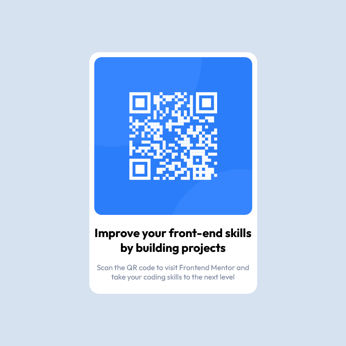

# Frontend Mentor - QR code component solution

This is a solution to the [QR code component challenge on Frontend Mentor](https://www.frontendmentor.io/challenges/qr-code-component-iux_sIO_H). Frontend Mentor challenges help you improve your coding skills by building realistic projects.

## Table of contents

- [Overview](#overview)
  - [Screenshot](#screenshot)
  - [Links](#links)
- [My process](#my-process)
  - [Built with](#built-with)
  - [What I learned](#what-i-learned)
  - [Continued development](#continued-development)
- [Author](#author)

## Overview

### Screenshot



### Links

- Solution URL: [Add solution URL here](https://github.com/ashap-bappy/qr-code-component-main)
- Live Site URL: [Add live site URL here](https://ashap-bappy.github.io/qr-code-component-main/)

## My process

### Built with

- HTML5 markup
- CSS custom properties
- Flexbox

### What I learned

```css
body {
  background-color: hsl(212, 45%, 89%);
  height: 100vh;
  margin: 0;
  display: flex;
  justify-content: center;
  align-items: center;
  box-sizing: border-box;
  font-family: "Outfit", sans-serif;
}

.main {
  background-color: hsl(0, 0%, 100%);
  width: 320px;
  border-radius: 20px;
  padding: 10px;
}

img {
  width: 100%;
  border-radius: 15px;
}

.nowrap {
  white-space: nowrap;
}

h1,
p {
  text-align: center;
}

h1 {
  color: hsl(218, 44%, 22%) m;
  font-size: 1.5rem;
  font-weight: 700;
}

p {
  color: hsl(220, 15%, 55%);
  font-size: 15px;
  font-weight: 400;
}
```

### Continued development

I want to continue development on my Flexbox skill. I'm still not compfortable with flexbox.

## Author

- Website - [Ashap Bappy](https://ashap-bappy.github.io/qr-code-component-main/)
- Frontend Mentor - [@ashap-bappy](https://www.frontendmentor.io/profile/yourusername)
